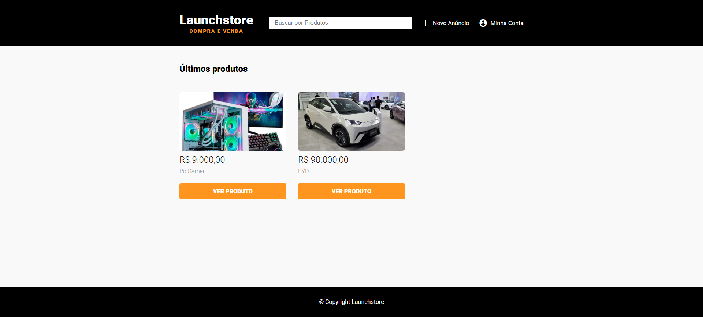
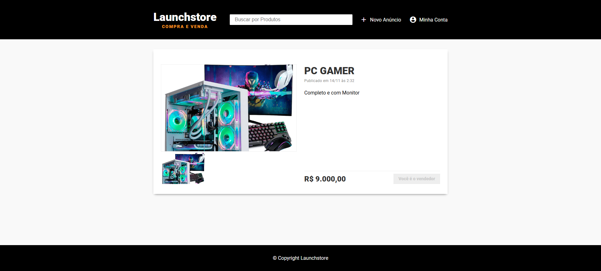
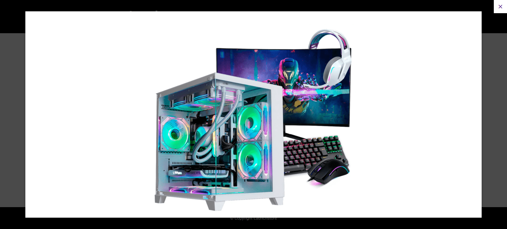
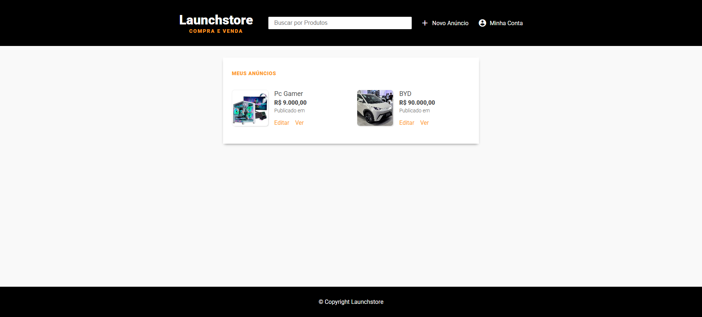

<h1 align="center">
   
</h1>
 <p align="center"> Application developed during Rocketseat’s LaunchBase Bootcamp. </P>  
 
<h2>  Project </h2>

<p> Launchstore is an e-commerce platform developed in Rocketseat's Launchbase bootcamp. It was built using HTML, CSS, JavaScript, Node.js, and PostgreSQL. </p>

<h2>How to install</h2>
<p> You need to install  <a href="https://nodejs.org/en/">Node.js</a>, <a href="https://www.postgresql.org/">PostgreSQL</a>

<h3> Steps <h3>
<h4> 1. Clone the repository <h4>

```
 $ git clone https://github.com/joaopa24/launchstore.git
```

```
Install the dependencies
$ npm install

Start the server
$ npm start
```

<h2>Results</h2>





